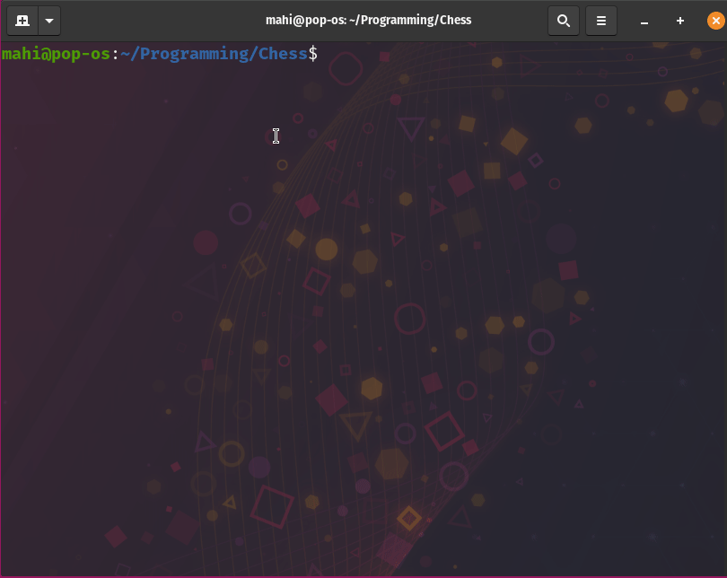
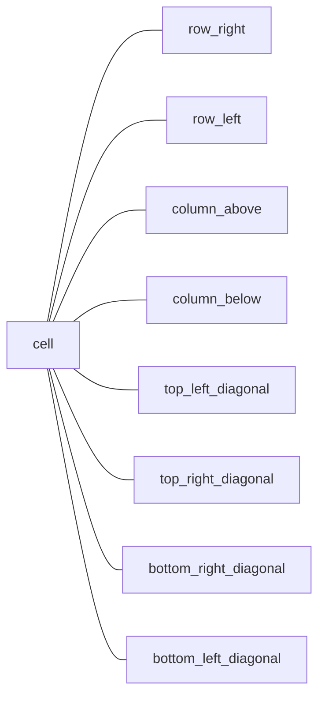

# [Chess](https://en.wikipedia.org/wiki/Chess)

This project is part of the [The Odin Project](https://www.theodinproject.com/paths/full-stack-ruby-on-rails/courses/ruby-programming/lessons/ruby-final-project)'s Ruby curriculum.

<details open="open">
  <summary>Table Of Contents</summary>
  <ol>
    <li>
      <a href="#description">Description</a>
    </li>
    <li>
      <a href="#demo">Demo</a>
    </li>
    <li>
      <a href="#built-with">Built With</a>
    </li>
    <li>
      <a href="#try-yourself">Try Yourself</a>
    </li>
    <li>
      <a href="#how-to-play">How To Play</a>
    </li>
    <li>
      <a href="#workflow">Workflow</a>
    </li>
    <li>
      <a href="#features">Features</a>
    </li>
    <li>
      <a href="#implementation-details">Implementation Details</a>
    </li>
    <li>
      <a href="#possible-enhancements">Possible Enhancements</a>
    </li>
     <li>
      <a href="#what-i-learned">What I Learned</a>
    </li>
     <li>
      <a href="#acknowledgements">Acknowledgements</a>
    </li>
  </ol>
</details>

## Description

### What is Chess?
Chess is a board game played between 2 players. More on Chess details [here](https://en.wikipedia.org/wiki/Chess).

### Why did I create this?
It's the capstone project of The Odin Project's Ruby Programming course to practice and utilize what I learned throughout the course.

### My experience
It's definitely a big project. I thought chess is a complicated game because I don't have much experience with chess before starting to work on this project. But after doing some research it clicked, it felt simple. Planning and Refactoring helped me stay in the right direction. I spent more time refactoring my code than writing the code. Honestly I enjoyed it. And here comes the important part, Tests. Without tests I can't imagine how I might approached this project. So overall I gained more experience in **Planning, Refactoring, Writing Unit Tests, Serialization, OOP concepts like SOLID, Inheritance, Composition, etc.**

## Demo

</br>
  
## Built With

| Tool         | Use Case                |
| ------------ | ----------------------- |
| Ruby         | Programming Language    |
| RSpec        | Unit Tests              |
| Git & GitHub | Source Code Management  |

## Try Yourself

### Online
You can try in mobile also...
Here's the [LINK](https://replit.com/@MaheshkumarP/Chess?lite=1&outputonly=1) to try online.

### Local

#### Prerequisites
```sh
ruby 3 - Recommended
ruby 2.7.4 or higher - Will work
```

#### Step 1: Clone the Repository
```sh
git clone git@github.com:Maheshkumar-novice/chess.git
```

#### Step 2: Move to Chess Directory
```sh
cd chess
```

#### Step 3: Run the main ruby file
```sh
ruby main.rb
```

#### To Run the Test Suite

#### Step 1: Install RSpec
```sh
gem install rspec
```

#### Step 2: Run the Test Suite
```sh
rspec
```

## How To Play

### General Instructions
* Run the game
* Choose Mode
* Create names if asked
* Board will be shown
* First prompt will ask you to choose a `source`, that is the cell of the piece you want to move
* You can enter `cmd` in this step to enter `command` mode
* Second prompt will ask you to choose a `destination`, that is the cell you want your piece to go

### Command Mode
* Available Commands: `draw`, `resign`, `save`, `fen`, `exit`
* `draw` - It'll propose draw to your opponent after the completion of your current move
* `resign` - It'll announce opponent as a winner
* `save` - Save your current game, named as `your-name-vs-opponent-name-date-time.yml` format
* `fen` - Shows the current FEN notation of the game
* `exit` - Exits from the command mode to the game

## Workflow

### General
* Research & Plan the feature by writing it down in a text editor
* Implement the feature
* Refactor
* Write Tests
* Refactor
* If the game playable, test it by playing

### Git
* [Long Running Branches](https://git-scm.com/book/en/v2/Git-Branching-Branching-Workflows) workflow
* `main` branch with most stable version
* `dev` branch with new feature updates, partially stable, will be merged into `main` once become stable
* `feature` branches to create new features and will be merged into `dev`

## Features

### Core
* Basic movements and captures
* Check
* Checkmate
* Stalemate
* Castling
* En Passant
* Promotion

### Additional
* 50 move rule Draw
* Manual Draw
* Resignation
* Command Mode
* Save & Load games
* Copy [FEN](https://www.chessprogramming.org/Forsyth-Edwards_Notation)
* Load a FEN game of your wish by passing it as a command line argument

### Others
* Colorful UI
* Mobile support

## Possible Enhancements
* Refactor Game class
* Validator for FEN
* 5 fold repetition Draw
* Insufficient material Draw
* Bot player improvement

## Implementation Details
Board is inspired from the **Graph** data strucutre. Board holds 64 cell objects, where each cell object know who is their neighbour. It is, each cell object stores the location of their `row_right`, `row_left`, `column_above`, `column_below`, `top_left_diagonal`, `top_right_diagonal`, `bottom_right_diagonal`, `bottom_left_diagonal` neighbours.

### Board
* Hash with 64 pieces
* **Key:** Symbol represent the cell coordinate (e.g. :a8)
* **Value:** A cell object represents the board cell

### Cell
* Object that holds the piece
* It stores the location of their neighbours


### Check
Whenever a player make a move their king shouldn't be in check.

### Knight Move
I designed knight's move as, one step forward in the four directions it can step and the diagonal moves related to that 
forward step.
For example, If the knight generate moves for it's left side,
  * It can step on the left side
  * It can go to either the top left diagonal or the bottom left diagonal

Then we use other objects to operate and manipulate this board and the pieces in the cells to play the game of chess.

## What I Learned
* Importance of Refactoring
* Importance of Planning
* Importance of Tests
* SOLID priniciples of OOP
* More about Composition
* More about Inheritance
* And more....
  
## Acknowledgements
* [The Odin Project](https://theodinproject.com)
* [Lichess](https://lichess.org)
* [Chess.com](https://chess.com)
* [Replit](https://replit.com)
* [Wikipedia](https://wikipedia.org)
* [Chess Variants](http://www.chessvariants.org/d.chess/chess.html)
* [Chess Programming](https://www.chessprogramming.org/Forsyth-Edwards_Notation)

Found an issue? [Click](https://github.com/Maheshkumar-novice/Chess/issues) here to raise an issue.

[Move To Top](#chess)
